<<<<<<< HEAD
# 🛍️ Forever E-Commerce

A full-stack MERN e-commerce platform with a customer storefront, admin dashboard, secure payments, order tracking, and newsletter campaign management.

[](https://opensource.org/licenses/ISC)

## 🔗 Live Links

- **Storefront:** [Forever Store](https://forever-frontend-alpha-mauve.vercel.app)
- **Admin Panel:** [Forever Admin](https://admin-iota-six-18.vercel.app)
- **Backend API:** [Forever API](https://forever-mu-orcin.vercel.app)

## ✨ Overview

Forever is a modern e-commerce application built with the MERN stack. It features a responsive customer storefront, a secure admin panel for product/order management, Stripe checkout with COD fallback, newsletter subscriptions with HMAC unsubscribe links, and campaign delivery tracking.

## 🚀 Features

### Customer Store
- User registration and authentication (JWT)
- Product browsing, search, and collection pages
- Product detail pages with size selection
- Shopping cart management
- Address book management
- Checkout with Cash on Delivery (COD) and Stripe
- Order history and order tracking
- Profile management and password change
- Newsletter subscription

### Admin Dashboard
- Secure admin authentication
- Product management (add, list, edit, delete)
- Order management and status updates
- Newsletter subscriber management
- Campaign composer with delivery history and transport status

### Backend API
- RESTful API with Express
- MongoDB with Mongoose ODM
- JWT-based authentication
- Role-based admin access
- Input validation and sanitization
- CORS with allowlist
- Centralized error handling

### Newsletter & Campaigns
- Subscriber management (subscribe/unsubscribe)
- HMAC-SHA256 unsubscribe tokens with versioning
- Bounded campaign delivery (batching/concurrency)
- Per-recipient delivery records
- Transport abstraction (Resend)

### Payments
- Stripe Checkout Sessions
- Webhook signature verification with raw body parsing
- Payment status tracking
- COD support

## 🛠️ Tech Stack


## 📁 Project Structure

`
ecommerance-app/
├── admin/          # Admin dashboard (React + Vite)
├── frontend/       # Customer storefront (React + Vite)
├── backend/        # API server (Express + MongoDB)
├── assets/         # Documentation assets
└── README.md
`
=======
# 🛍️ Forever

### Full-Stack MERN E-Commerce Platform

A modern full-stack e-commerce application with a customer storefront, admin dashboard, secure authentication, Stripe payments, order tracking, Cloudinary image management, and newsletter campaigns.

[](https://react.dev/)
[](https://nodejs.org/)
[](https://expressjs.com/)
[](https://www.mongodb.com/)
[](https://stripe.com/)
[](https://vercel.com/)

<<<<<<< HEAD
[Storefront](https://forever-frontend-alpha-mauve.vercel.app) ·
[Admin Panel](https://admin-iota-six-18.vercel.app) ·
[Backend API](https://forever-mu-orcin.vercel.app)
=======
[**Storefront**](https://forever-frontend-alpha-mauve.vercel.app/) ·
[**Admin Panel**](https://admin-iota-six-18.vercel.app) ·
[**Backend API**](https://forever-mu-orcin.vercel.app)
>>>>>>> b2850247ca1a2d091c4281f91470bacb96f539ed

---

## ✨ Overview

**Forever** is a MERN e-commerce platform composed of three connected applications:

<<<<<<< HEAD
- **Customer Storefront** — browse, search, purchase, and track products.
- **Admin Dashboard** — manage products, orders, subscribers, and campaigns.
- **REST API** — authentication, business logic, database access, payments, images, and email delivery.
=======
- **Customer Storefront** — browse, search, purchase, and track products.
- **Admin Dashboard** — manage products, orders, newsletter subscribers, and campaigns.
- **REST API** — handles authentication, business logic, database access, payments, images, and email delivery.

---

## 📸 Screenshots

### 🏠 Storefront

#### Home

[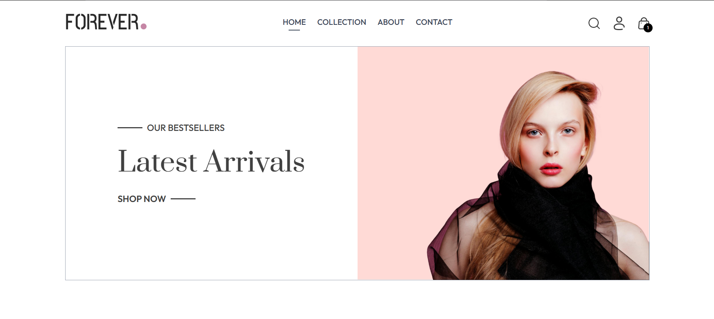](https://github.com/MuaddhAlsway/Forever_Mu/blob/main/screenshot/Home01.png)

[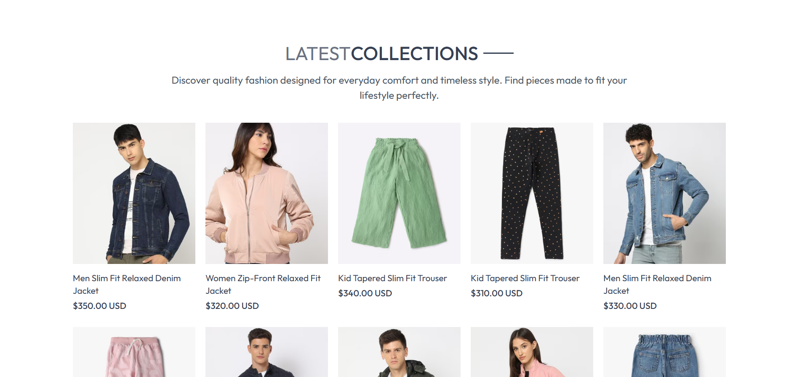](https://github.com/MuaddhAlsway/Forever_Mu/blob/main/screenshot/Home02.png)

#### Best Seller

[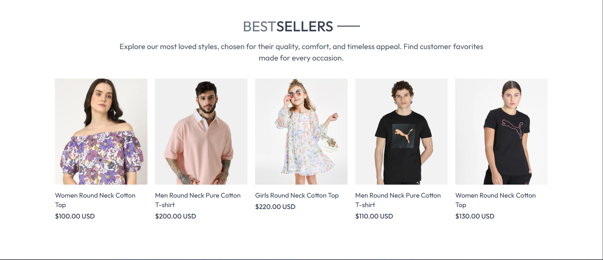](https://github.com/MuaddhAlsway/Forever_Mu/blob/main/screenshot/BestSeller.png)

#### Collection

[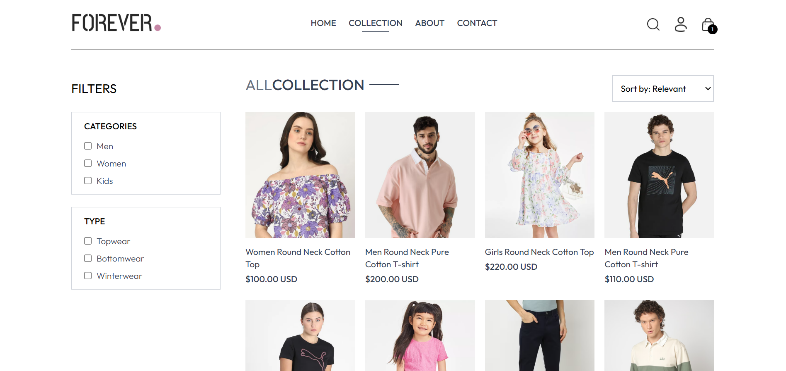](https://github.com/MuaddhAlsway/Forever_Mu/blob/main/screenshot/Collection.png)

#### Cart

[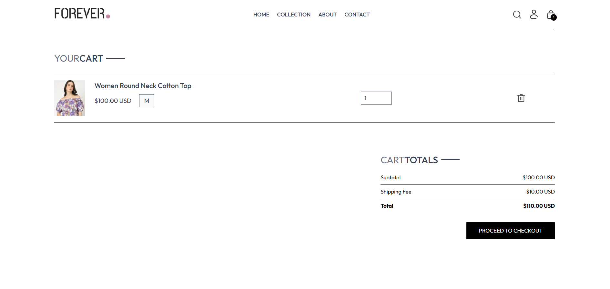](https://github.com/MuaddhAlsway/Forever_Mu/blob/main/screenshot/Cart.png)

#### Payment

[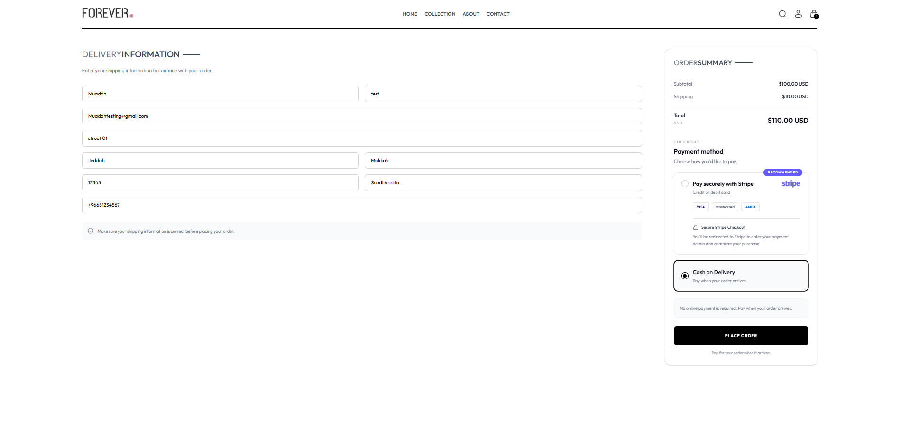](https://github.com/MuaddhAlsway/Forever_Mu/blob/main/screenshot/Payment.png)

#### My Orders

[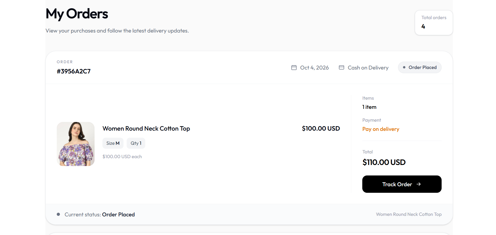](https://github.com/MuaddhAlsway/Forever_Mu/blob/main/screenshot/MyOrder.png)

#### Track Order

[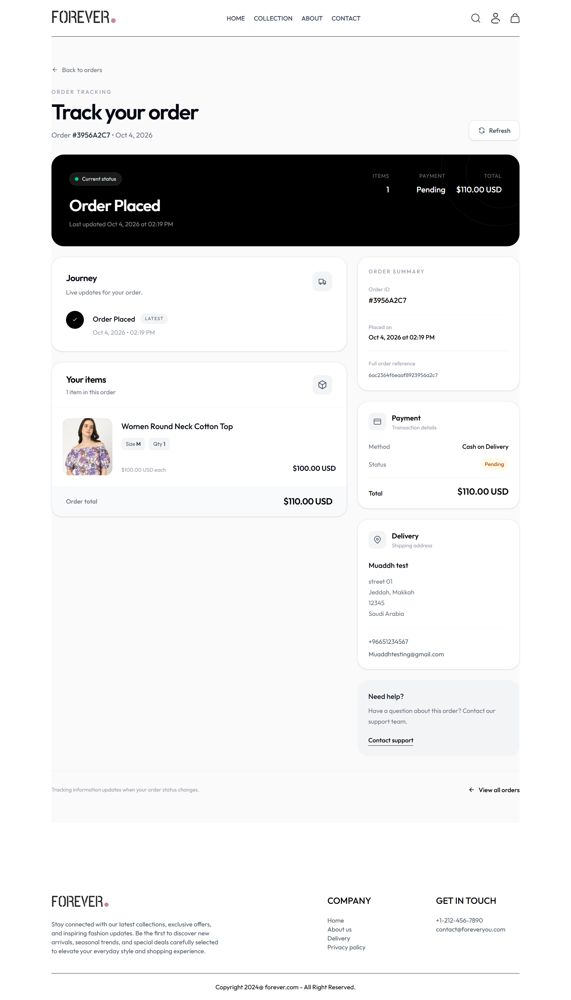](https://github.com/MuaddhAlsway/Forever_Mu/blob/main/screenshot/TrackOurOrder.png)

#### About Us

[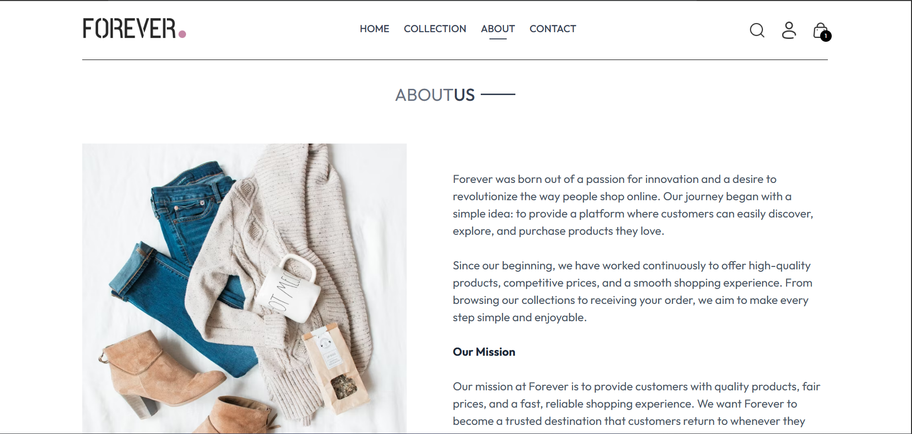](https://github.com/MuaddhAlsway/Forever_Mu/blob/main/screenshot/aboutus.png)

#### Contact Us

[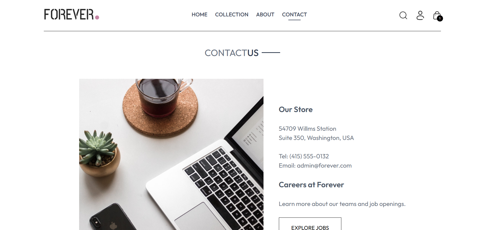](https://github.com/MuaddhAlsway/Forever_Mu/blob/main/screenshot/ContactUS.png)

#### Policy & Newsletter Subscription

[](https://github.com/MuaddhAlsway/Forever_Mu/blob/main/screenshot/Policy%26Subscirbe.png)

### ⚙️ Admin Dashboard

#### Admin Overview

[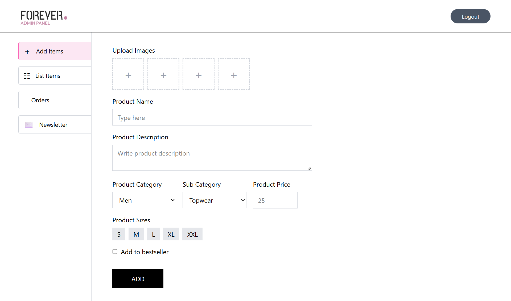](https://github.com/MuaddhAlsway/Forever_Mu/blob/main/screenshot/admin01.png)

#### Product Management

[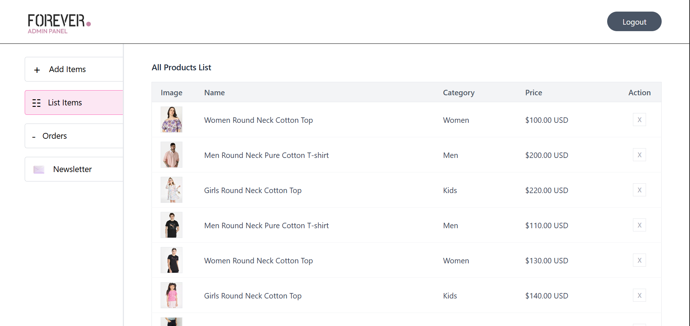](https://github.com/MuaddhAlsway/Forever_Mu/blob/main/screenshot/admin02.png)

#### Order Management

[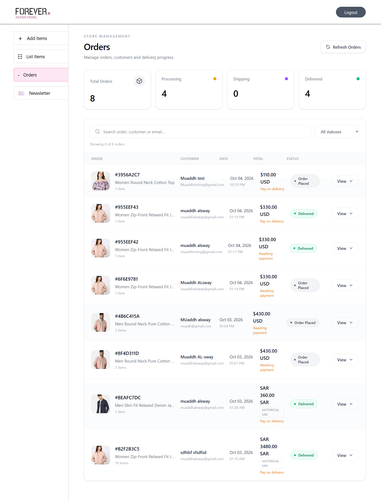](https://github.com/MuaddhAlsway/Forever_Mu/blob/main/screenshot/admin03.png)

#### Admin Management

[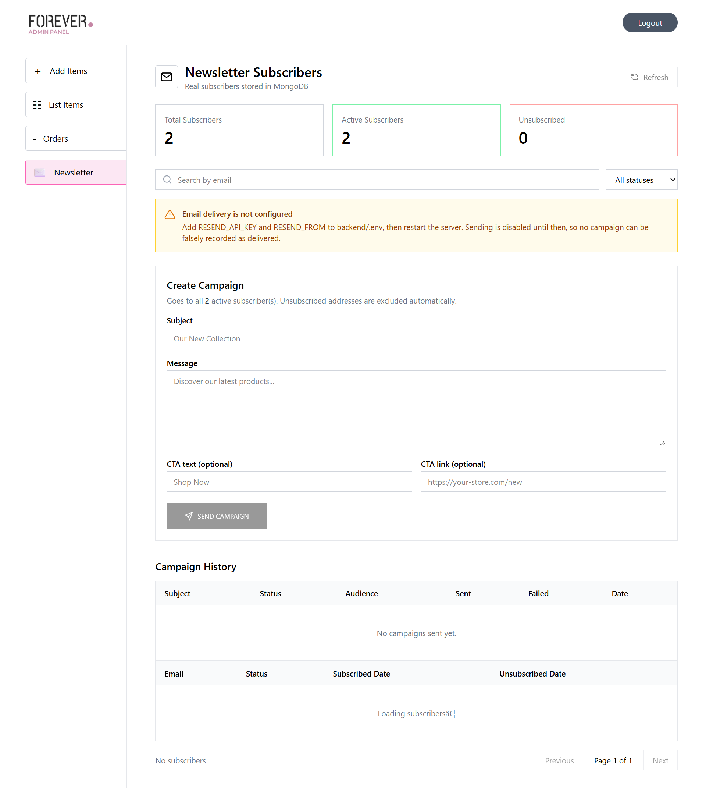](https://github.com/MuaddhAlsway/Forever_Mu/blob/main/screenshot/admin04.png)
>>>>>>> b2850247ca1a2d091c4281f91470bacb96f539ed

---

## 🚀 Features

### 🛍️ Customer Store

- User registration and login
- JWT authentication and authorization
- Product catalog and product details
- Product search and filtering
- Shopping cart management
- Address management
- Cash on Delivery
- Stripe checkout
- Order history and tracking
- Newsletter subscription
- Responsive interface
- Toast notifications

### ⚙️ Admin Dashboard

- Secure admin login
- Add and remove products
- Upload product images
- Manage customer orders
- Update order status
- Manage newsletter subscribers
- Create email campaigns
- Send campaign emails

### 🔌 Integrations

<<<<<<< HEAD
- **Stripe** — online payments
- **Cloudinary** — image storage and optimization
- **Resend** — transactional and campaign emails
- **MongoDB** — application database
- **Vercel** — application deployment
=======
- **Stripe** — online payment processing
- **Cloudinary** — product image storage and optimization
- **Resend** — transactional and campaign email delivery
- **MongoDB** — application database
- **Vercel** — frontend, admin, and backend deployment
>>>>>>> b2850247ca1a2d091c4281f91470bacb96f539ed

---

## 🛠️ Tech Stack

| **Frontend** | **Backend** | **Database** | **Authentication** | **Services & Deployment** |
| :---: | :---: | :---: | :---: | :---: |
|  |  |  |  |  |
|  |  |  |  |  |
|  |  |  |  |  |
|  |  |  |  |  |
|  |  |  |  |  |
|  |  |  |  |  |

### Stack Overview

- **Frontend:** React, Vite, React Router, Axios, React Toastify, Tailwind CSS
- **Admin Panel:** React, Vite, React Router, Axios, React Toastify, Tailwind CSS
- **Backend:** Node.js, Express, Mongoose, Validator, CORS, dotenv
- **Database:** MongoDB
- **Authentication:** JWT + bcrypt
- **Payments:** Stripe
- **Media:** Cloudinary
- **Email:** Resend
- **Deployment:** Vercel

---

## 🧱 Architecture

```text
Customer Store ─────┐
                    │
Admin Dashboard ────┼──► Express REST API ───► MongoDB
                    │           │
                    │           ├──► Cloudinary
                    │           ├──► Stripe
                    │           └──► Resend
                    │
                    └── Axios / HTTP
```

---

## 📁 Project Structure

```text
forever/
<<<<<<< HEAD
├── frontend/
│   ├── src/
│   │   ├── assets/
│   │   ├── components/
│   │   ├── context/
│   │   ├── pages/
│   │   └── App.jsx
│   └── package.json
│
├── admin/
│   ├── src/
│   │   ├── assets/
│   │   ├── components/
│   │   ├── pages/
│   │   └── App.jsx
│   └── package.json
│
├── backend/
│   ├── config/
│   ├── controllers/
│   ├── middleware/
│   ├── models/
│   ├── routes/
│   └── server.js
│
└── README.md
=======
├── frontend/
│   ├── src/
│   │   ├── assets/
│   │   ├── components/
│   │   ├── context/
│   │   ├── pages/
│   │   └── App.jsx
│   └── package.json
│
├── admin/
│   ├── src/
│   │   ├── assets/
│   │   ├── components/
│   │   ├── pages/
│   │   └── App.jsx
│   └── package.json
│
├── backend/
│   ├── config/
│   ├── controllers/
│   ├── middleware/
│   ├── models/
│   ├── routes/
│   └── server.js
│
├── screenshot/
│   ├── Home01.png
│   ├── Home02.png
│   ├── BestSeller.png
│   ├── Collection.png
│   ├── Cart.png
│   ├── Payment.png
│   ├── MyOrder.png
│   ├── TrackOurOrder.png
│   ├── aboutus.png
│   ├── ContactUS.png
│   ├── Policy&Subscirbe.png
│   ├── admin01.png
│   ├── admin02.png
│   ├── admin03.png
│   └── admin04.png
│
└── README.md
>>>>>>> b2850247ca1a2d091c4281f91470bacb96f539ed
```

---
>>>>>>> 27cb7e258cd3fa0ab5492088546b5f3e717cfc93

## âš¡ Getting Started

### Prerequisites
<<<<<<< HEAD
- Node.js v18+
- MongoDB instance (local or Atlas)
=======

- Node.js 18+
- npm
- MongoDB instance
>>>>>>> 27cb7e258cd3fa0ab5492088546b5f3e717cfc93
- Stripe account
- Cloudinary account
- Resend account

<<<<<<< HEAD
### Installation
`ash
# Install backend dependencies
cd backend && npm install

# Install frontend dependencies
cd ../frontend && npm install

# Install admin dependencies
cd ../admin && npm install
`
=======
### Clone the Repository

```bash
git clone https://github.com/MuaddhAlsway/Forever_Mu.git
cd Forever_Mu
```

### Install Dependencies

```bash
cd backend
npm install

cd ../frontend
npm install

cd ../admin
npm install
```
>>>>>>> 27cb7e258cd3fa0ab5492088546b5f3e717cfc93

---

<<<<<<< HEAD
#### Backend (ackend/.env)
`env
=======
## 🔐 Environment Variables

Create `backend/.env`:

```env
>>>>>>> 27cb7e258cd3fa0ab5492088546b5f3e717cfc93
MONGODB_URL=
JWT_SECRET=

ADMIN_EMAIL=
ADMIN_PASSWORD=

STRIPE_SECRET_KEY=

FRONTEND_URL=
ADMIN_URL=

RESEND_API_KEY=
RESEND_FROM=
NEWSLETTER_UNSUBSCRIBE_BASE_URL=
<<<<<<< HEAD
NEWSLETTER_CAMPAIGN_MAX_RECIPIENTS=2000
NEWSLETTER_UNSUBSCRIBE_SECRET=
`

#### Frontend (rontend/.env)
`env
=======
```

Create `frontend/.env`:

```env
>>>>>>> 27cb7e258cd3fa0ab5492088546b5f3e717cfc93
VITE_BACKEND_URL=
```

<<<<<<< HEAD
#### Admin (dmin/.env)
`env
=======
Create `admin/.env`:

```env
>>>>>>> 27cb7e258cd3fa0ab5492088546b5f3e717cfc93
VITE_BACKEND_URL=
```

<<<<<<< HEAD
### Development
`ash
# Backend
cd backend && npm run server

# Frontend
cd frontend && npm run dev

# Admin
cd admin && npm run dev
`

### Production Build
`ash
# Frontend
cd frontend && npm run build

# Admin
cd admin && npm run build
`

## ☁️ Deployment

Deployed on [Vercel](https://vercel.com/). Set environment variables in each Vercel project. Note: VITE_* variables are embedded at build time, so frontend/admin require fresh builds after changes.

## 🔒 Security

- JWT authentication with secure verification
- Admin routes protected with custom auth middleware
- Stripe webhook signature verification with raw body
- HMAC unsubscribe tokens (no secrets stored in DB)
- CORS restricted to allowlisted origins
- Input sanitization and validation
- No secrets exposed in client code

## 📄 License

This project is licensed under the ISC License.
=======
> [!IMPORTANT]
> Never commit `.env` files, passwords, database credentials, API keys, or other secrets to GitHub.

---

## 💻 Development

Run each application in a separate terminal.

### Backend

```bash
cd backend
npm run server
```

### Storefront

```bash
cd frontend
npm run dev
```

### Admin

```bash
cd admin
npm run dev
```

---

## 📦 Production Build

### Frontend

```bash
cd frontend
npm run build
```

### Admin

```bash
cd admin
npm run build
```

---

## ☁️ Deployment

| Application | Platform | Status |
| --- | --- | --- |
| Customer Storefront | Vercel | 🟢 Live |
| Admin Dashboard | Vercel | 🟢 Live |
| Backend API | Vercel | 🟢 Live |
| Database | MongoDB | 🟢 Connected |
| Images | Cloudinary | 🟢 Integrated |
| Payments | Stripe | 🟢 Integrated |
| Email | Resend | 🟢 Integrated |

### Live Applications

<<<<<<< HEAD
- **Storefront:** https://forever-frontend-alpha-mauve.vercel.app
=======
- **Storefront:** https://forever-frontend-alpha-mauve.vercel.app/
>>>>>>> b2850247ca1a2d091c4281f91470bacb96f539ed
- **Admin:** https://admin-iota-six-18.vercel.app
- **Backend API:** https://forever-mu-orcin.vercel.app

---

## 🔒 Security

- Password hashing with bcrypt
- JWT-based authentication and authorization
- Protected admin operations
- Input validation
- CORS configuration
- Environment-based secrets
- Stripe-managed payment processing
- Secure newsletter unsubscribe flow

---

## 🗺️ Roadmap

- [x] Authentication
- [x] Product catalog
- [x] Search and filtering
- [x] Shopping cart
- [x] Address management
- [x] Cash on Delivery
- [x] Stripe checkout
- [x] Order tracking
- [x] Admin dashboard
- [x] Cloudinary image management
- [x] Newsletter subscriptions
- [x] Email campaigns

---

## 📄 License

This project is licensed under the **ISC License**.

---

### Built with MERN âš¡

**React · Node.js · Express · MongoDB**

Stripe · Cloudinary · Resend · Vercel

**2026**
>>>>>>> 27cb7e258cd3fa0ab5492088546b5f3e717cfc93

